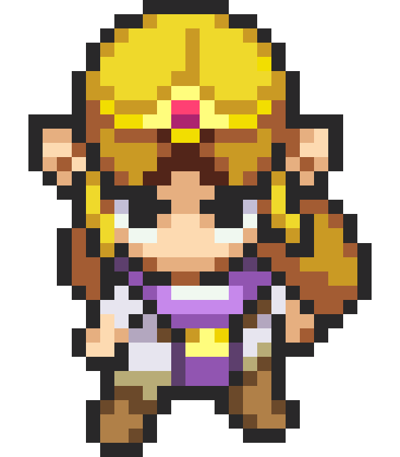

# Hey there! 

  

## About me

I'm a software developer based in Spain, focused on building web products that feel reliable, maintainable, and pleasant to use. I like working where product thinking meets engineering discipline: clear architecture, thoughtful UI, and code that can survive contact with reality.

- 💼 I work at **Sipay**, as part of the **Sipos** team, integrating payment gateways with point-of-sale systems.
- 🎵 I love music and spend a good amount of time with my headphones on. You can find me on [TIDAL](https://tidal.com/@piioni).

Building practical software with clean structure, solid UX, and just enough chaos to keep it interesting.

## Tech stack

### Languages

### Frameworks

### Tools

## Featured projects

<table>
  <tr>
    <td width="33%" valign="top">
      
      <h3>Veritix</h3>
      
Ticketing-focused product work centered on building practical experiences with a clean, structured approach.

    </td>
    <td width="33%" valign="top">
      
      <h3><a href="https://github.com/Piioni/Portfolio">Portfolio</a></h3>
      
My personal portfolio, where I present my projects, design sensibility, and the way I think about software.

    </td>
    <td width="33%" valign="top">
      
      <h3><a href="https://github.com/Piioni/Pegasus-Medical-WebPage">Pegasus Medical</a></h3>
      
A medical web project focused on polished presentation, solid structure, and a professional frontend feel.

    </td>
  </tr>
</table>

## How to reach me

Want to talk to me? Ask me something? Share an idea, a project, or just say hi? Sure.
I’m usually around, although sometimes I take a little while to reply.

  &nbsp;&nbsp;&nbsp;
  &nbsp;&nbsp;&nbsp;
  &nbsp;&nbsp;&nbsp;
  &nbsp;&nbsp;&nbsp;
  

## Beyond code

<table align="center" border="0" cellpadding="0" cellspacing="0" role="presentation">
  <tr>
    <td align="left" valign="middle">
      
    </td>
    <td align="center" valign="middle">
      
        Music, good games, and thoughtful software. 
        I’m drawn to clean structure, quiet details, and digital worlds with soul — somewhere between careful craft and Hyrule.
      
    </td>
    <td align="right" valign="middle">
      
    </td>
  </tr>
</table>

> "One must imagine Sisyphus happy."
>
> &mdash; `Albert Camus`
